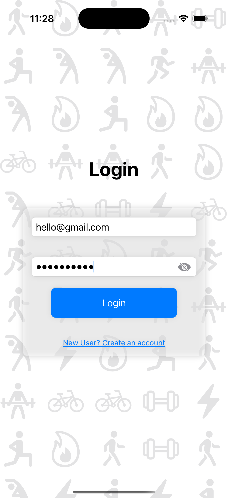
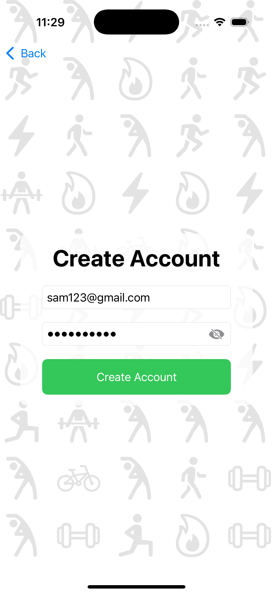
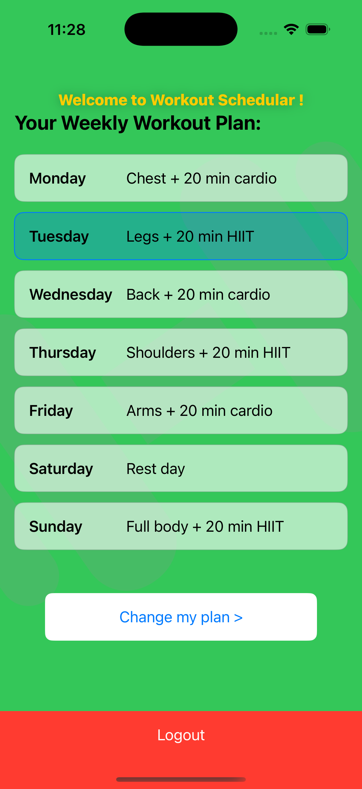
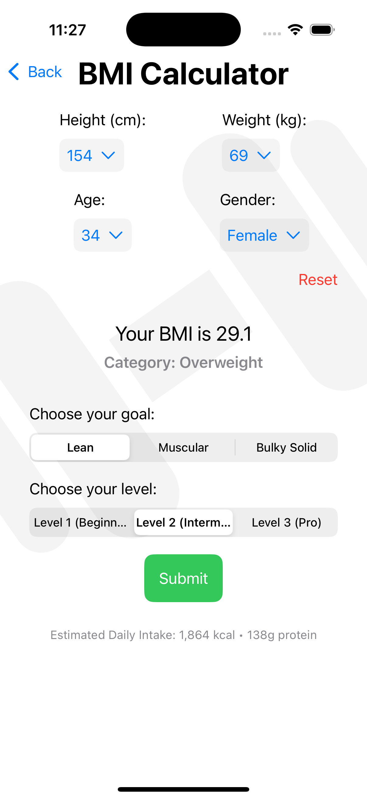
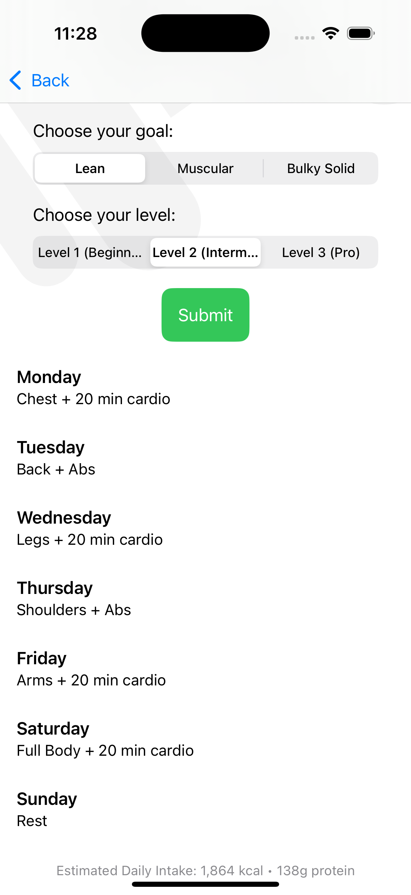

# Workout Scheduler – AI-Powered Fitness Planner App

An AI-driven iOS fitness app built with SwiftUI and Flask backend that generates personalized workout plans based on user goals, BMI, gender, and fitness level.

---

## Features

- **Custom Workout Plan Generator**  
  Generates a 7-day gym workout plan using OpenAI's GPT model.

- **Health Input Form with Live BMI Calculation**  
  Users enter height, weight, age, gender, and get real-time BMI updates.

- **Goal & Level-Based Plan Customization**  
  Users choose from goals like `Lean`, `Muscular`, or `Bulky Solid`, and levels like `Beginner`, `Intermediate`, or `Pro`.

- **Secure Login & Signup with JWT Authentication**  
  Backend powered by Flask and PostgreSQL with JWT-based token storage in Keychain.

- **Persistent Cloud Storage**  
  Workout plans are saved to a PostgreSQL database on Render and tied to the logged-in user.

- **CI/CD with GitHub Actions**  
  Full test pipeline using Pytest + SQLite memory DB for backend.

- **Clean SwiftUI Interface with Dynamic Home Screen**  
  Home screen displays the current workout plan in a clean, table-style layout, with today's workout highlighted.

---

## Technologies Used

### * Frontend (iOS App)
- SwiftUI
- KeychainWrapper
- URLSession
- Dynamic form elements (Menu, SegmentedPicker, ScrollView)

### * Backend (API Server)
- Flask
- SQLAlchemy
- PostgreSQL (Render)
- OpenAI API (GPT-3.5)
- Flask-JWT-Extended
- Flask-CORS

### * DevOps
- GitHub Actions (CI/CD)
- Pytest
- Render Cloud Hosting

---

## 🖼 Screenshots

| Login Page | SignUp Page |
|-----------------------------|-----------------------------|
|  |  |

| Home View |
|-----------------------------|
|  |

| Get info from the user | Provide the user with a Perfect Workout plan |
|-----------------------------|-----------------------------|
|  |  |

---

## Getting Started

1. Clone this repo
2. `cd backend/ && pip install -r requirements.txt`
3. `flask run` locally or deploy to Render
4. Open `Workout_Schedular.xcodeproj` in Xcode and run on Simulator

---

## License

This project is licensed under the MIT License – see the [LICENSE](LICENSE) file for details.

---

## Author

**Samrudh Surendra**  
Passionate iOS Developer  
[LinkedIn](https://www.linkedin.com/in/samrudh-surendra1)
